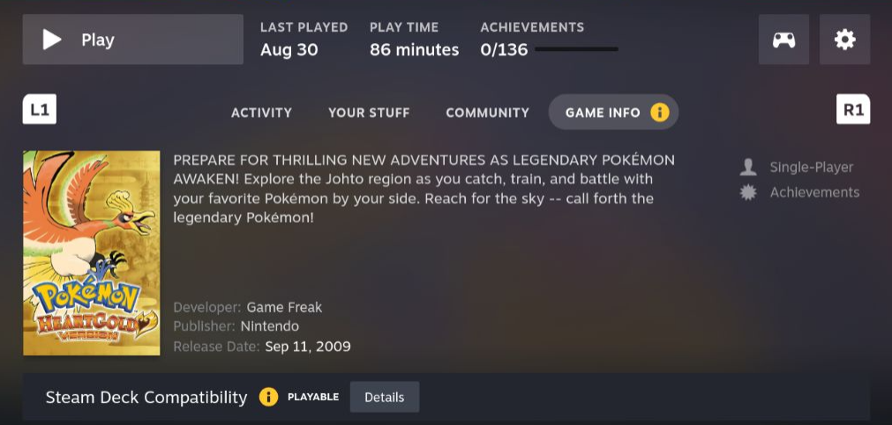

<h1 align="center"> Chrono Deck plugin for Decky Loader</h1>

   *

Brings metadata for **Emulated** games for a better native experience.

Help me to add more information: [Google Forms](https://docs.google.com/forms/d/1Wp2sE3oI7JI1smGe_vHYUI_HMI_GLqiK9_X5En8rQdU)

 
  

> [!IMPORTANT]
> Internet connection is mandatory.
> 
> If some of your games are detected wrongly:
>   1. Check if **Display Name** of a game is correct.
>   2. Verify in **Google Sheets** exists game with your name

* - very basic information is present. It may not show actuall state of a game.

